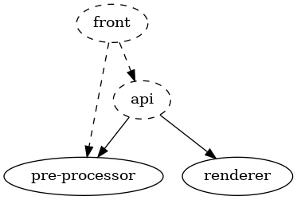

# HISTmap

## Run from prebuilt images

Edit `docker-compose.yml` to run proxy on port other than `80`.

```sh
$ docker pull kopernick/histmap-api:latest         # 566MB
$ docker pull kopernick/histmap-front-proxy:latest #  32MB
$ docker-compose up -d
```
## Build images and run

This step assumes that `data/data.json` or `data/data` file is present.
If not, check the "Data pre-processing" section.

```sh 
$ docker-compose up -d --build
```

## Run locally

We use [lerna](https://github.com/lerna/lerna) to manage multiple packages in the monorepo.

This steps assume that `data/data.json` or `data/data` file is present.
If not, check the "Data pre-processing" section.

To install dependencies in all packages run:
```sh
$ lerna bootstrap
```

Dependency graph is shown in the following Figure.



### Production

To build and run project in production environment execute following commands:
```sh
$ lerna run --scope api --scope front --include-filtered-dependencies --stream build 
$ lerna run --scope api start
```
To run front you have to host static files from  `packages/front/dist` directory.

### Development
Commands can be executed though lerna or directly using `npm` from package directory.

To run `api` in development environment:
```sh
$ lerna run --scope api --stream start:debug 
```

To run `front` in development environment:
```sh
$ lerna run --scope front --stream serve
```

## Data pre-processing

### Data directory structure

[/data](data) directory holds all of the input data necessary to make
pre-processed data (i.e. `data/data.json` and `data/data`).

The input data consists of the following files:

* `data/bn_geos_2.db`: SQLite database with publications – a table named
  `BOOKS`, from which the following columns are being read: `TITLE`, `AUTHORS`,
  `PUBLICATION_PLACES`, `YEAR`, `GEOGRAPHIC_NAMES`. Rows, in which
  `GEOGRAPHIC_NAMES` is an empty string are ignored. Geographic names are
  further split using `" , "` as a seperator (a comma surrounded by spaces on
  both sides).
* `data/places.txt`: List of named places, for which we know their location.
  These names are compared againts those from the database (after splitting).
* `data/places/`: Directory of results from Google's
  [geocoding API](https://developers.google.com/maps/documentation/geocoding/overview).
  Within this directory there are many JSON files, each corresponding to a line
  from `data/places.txt`, containing a result from querying that name. File
  names have to conform to pattern `/[0-9]{5}\.json/`. File named `00000.json`
  contains result from querying the first line of `data/places.txt` (which is
  usually presented as line number 1 in editors), `00001.json` contains result
  from querying the second line and so on. A file cannot be missing.
* `data/places2/`: Directory of results from
  [Nominatim API](https://nominatim.org/release-docs/latest/api/Overview/).
  Nominatim API can be self-hosted or accessed through many
  [third-party providers](https://wiki.openstreetmap.org/wiki/Nominatim). The
  directory structure is similar to `data/places`. API queries ask explicitly
  for geojson result. While this API could in theory be sufficient, Google's API
  has proven to be far more reliable (much higher success rate), so it serves as
  a fallback.

Input JSONs are then preprocessed. Only crucial data is extracted and saved in
condensed binary files:

* `data/places.bin`: Contains coordinates from `data/places/` directory.
* `data/places2.bin`: Contains polygon coordinates from `data/places2/`
  directory.

Main pre-processor is then run and `data/data.json` file is created. Finally,
`data/data.json` gets compressed into `data/data` file.

### Running pre-processor

Make sure you have all the necessary input data already in place. To run the
pre-processor, you need Node.js, npm, CMake and a C++ compiler.

1. Navigate to `packages/pre-processor` directory.
2. Run `npm run preparse`. JSON files from `data/places/` and
   `data/places2/` will be processed into binary files.
3. Run `npm run build`. This will run the CMake script creating project
   files for a release build and then build the project.
4. Run `npm run execute`. This will run the main pre-processor, which
   creates `data/data.json` file, and then a script that compresses it into
   `data/data`.

You can also run `npm run all` to run steps 2 to 4 in sequence.

If you use [lerna](https://github.com/lerna/lerna) you can run these commands directly
from the workspace root e.g. `lerna run --scope pre-processor all`

### Updating data

1. Add new rows to `data/bn_geos_2.db`.
2. Extract place names from new rows, splitting them using `" , "` as a
   seperator. If there are any places not present in `data/places.txt`, add them
   at the end. *Note that there are no helper scripts for this step in this
   repository.*
3. If there weren't any new place names, run the pre-processor as described
   above (it is enough to run `npm run execute` if previous steps have been run
   before) and you're done.
4. Query Google geocoding API and Nominatim API for new places and put results
   in `data/places/` and `data/places2/`. Check out
   [geocode.js](packages/pre-processor/src/geocode.js) and
   [geocode2.js](packages/pre-processor/src/geocode2.js) for reference. These
   scripts are meant to be run from `data/` as a working directory. They don't
   make a query if a corresponding JSON file already exists. API keys have been
   removed and have to be obtained and filled in.
5. Rerun the pre-processor. It is enough to run `npm run preparse` and then
   `npm run execute` if the C++ code hasn't been altered.

### Configuring pre-processor

Main part of pre-processor (the one writen in C++) contains some constants that
can be experimented with. These are:

* [`EXPANSION_PIXEL_HSPACING` and `EXPANSION_PIXEL_VSPACING`](packages/pre-processor/src/main.cpp#L20-L21)
  affect horizontal and vertical spacing of single points that, when placed near
  each other, make up an interior of a polygon. The pattern tries to make a
  triangular grid, with every other row shifted by half its spacing. Therefore,
  vertical spacing should be approximately equal to horizontal spacing
  multiplied by `0.5 * sqrt(3)`.
* [`MAX_EXPANSION_PIXEL_EXTENT`](packages/pre-processor/src/main.cpp#L22)
  affects which areas are skipped during expansions. To save memory, areas that
  are very large when zoomed in can be skipped. When specific polygon at a given
  zoom level has an extent (width or height of its axis-aligned bounding box,
  whichever is higher) measured in pixels higher than the given constant, it is
  skipped and won't appear in output data.
* [`MAX_ZOOM_LEVEL`](packages/pre-processor/src/data.h#L17) determines the 
  highest zoom level (inclusive) that the output data will support.
* [`MAX_EXPANSION_LEVEL`](packages/pre-processor/src/data.h#L18) determines the
  highest zoom level for which polygons will appear. It can be made lower than
  `MAX_ZOOM_LEVEL` in order to save space. It must not be higher than
  `MAX_ZOOM_LEVEL`.

Remember to run `npm run build` to rebuild the pre-processor after making
any changes to its source code.

## Adjust generated areas

  ### Obtaining GeoJSON

  If you want to change or create polygon for wrongly determined areas, you have to get coordinates of the area in the first place. One way of obtaining them is listed below.

  1. Go to https://www.keene.edu/campus/maps/tool/
  2. Insert points by right-clicking on the map.
  3. Click `Close Shape` button.
  4. Copy generated JSON. `Polygon` and `MultiPolygon` are supported.

  
  
  ### Editing data files

  Each area is described by its name, point in `{workspaceRoot}/data/places` and area in `{workspaceRoot}/data/places2`. Points and areas are obtained from web API. Coordinates of ares are expressed in GeoJSON `Polygon` or `MultiPolygon` format.

  1. Go to file `{workspaceRoot}/data/places.txt`.
  2. Note the line number `n` of the place you want to edit polygon.
  3. Go to `{workspaceRoot}/data/places2` directory and find file named `{n-1}.json` (file with the name corresponding to line number `n` but enumerated from `0`).
  4. Paste generated JSON (described above) into the `geojson` field.
  5. Run pre-processing: `lerna run --scope pre-processor all`.
  6. Rebuild images or reload the app.
